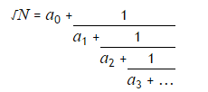

Odd period square roots
-----------------------

*Source: https://projecteuler.net/problem=64*

*Difficulty rating: 20%*

All square roots are periodic when written as continued fractions and
can be written in the form:

For example, let us consider √23:

If we continue we would get the following expansion:

The process can be summarised as follows:

It can be seen that the sequence is repeating. For conciseness, we use
the notation √23 = [4;(1,3,1,8)], to indicate that the block (1,3,1,8)
repeats indefinitely.

The first ten continued fraction representations of (irrational) square
roots are:

Exactly four continued fractions, for N ≤ 13, have an odd period.

How many continued fractions for N ≤ 10000 have an odd period?
