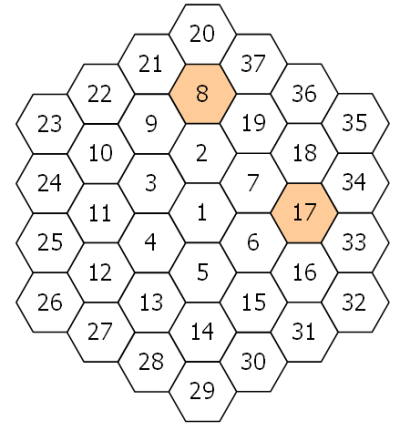

Hexagonal tile differences
--------------------------

*Source: https://projecteuler.net/problem=128*

*Difficulty rating: 55%*

A hexagonal tile with number 1 is surrounded by a ring of six hexagonal
tiles, starting at "12 o'clock" and numbering the tiles 2 to 7 in an
anti-clockwise direction.

New rings are added in the same fashion, with the next rings being
numbered 8 to 19, 20 to 37, 38 to 61, and so on. The diagram below shows
the first three rings.

By finding the difference between tile *n* and each of its six
neighbours we shall define PD(*n*) to be the number of those differences
which are prime.

For example, working clockwise around tile 8 the differences are 12, 29,
11, 6, 1, and 13. So PD(8) = 3.

In the same way, the differences around tile 17 are 1, 17, 16, 1, 11,
and 10, hence PD(17) = 2.

It can be shown that the maximum value of PD(*n*) is 3.

If all of the tiles for which PD(*n*) = 3 are listed in ascending order
to form a sequence, the 10th tile would be 271.

Find the 2000th tile in this sequence.
