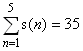

Investigating Gaussian Integers
-------------------------------

*Source: https://projecteuler.net/problem=153*

*Difficulty rating: 65%*

As we all know the equation x2=-1 has no solutions for real x.\
 If we however introduce the imaginary number i this equation has two
solutions: x=i and x=-i.\
 If we go a step further the equation (x-3)2=-4 has two complex
solutions: x=3+2i and x=3-2i.\
x=3+2i and x=3-2i are called each others' complex conjugate.\
 Numbers of the form a+bi are called complex numbers.\
 In general a+bi and a−bi are each other's complex conjugate.

A Gaussian Integer is a complex number a+bi such that both a and b are
integers.\
 The regular integers are also Gaussian integers (with b=0).\
 To distinguish them from Gaussian integers with b ≠ 0 we call such
integers "rational integers."\
 A Gaussian integer is called a divisor of a rational integer n if the
result is also a Gaussian integer.\
 If for example we divide 5 by 1+2i we can simplify
 in the following manner:\
 Multiply numerator and denominator by the complex conjugate of 1+2i:
1−2i.\
 The result is .\
 So 1+2i is a divisor of 5.\
 Note that 1+i is not a divisor of 5 because
.\
 Note also that if the Gaussian Integer (a+bi) is a divisor of a
rational integer n, then its complex conjugate (a−bi) is also a divisor
of n.

In fact, 5 has six divisors such that the real part is positive: {1, 1 +
2i, 1 − 2i, 2 + i, 2 − i, 5}.\
 The following is a table of all of the divisors for the first five
positive rational integers:

  ------------------------ ------------------------ ------------------------
  n                        1                        2
  Gaussian integer         1                        1, 1+i, 1-i, 2
  divisors\                1                        5
   with positive real part                          
  Sum s(n) of\                                      
  these divisors                                    
  ------------------------ ------------------------ ------------------------

For divisors with positive real parts, then, we have:
.

For 1 ≤ n ≤ 105, ∑ s(n)=17924657155.

What is ∑ s(n) for 1 ≤ n ≤ 108?
