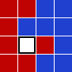

Sliders
-------

*Source: https://projecteuler.net/problem=244*

Published on Saturday, 9th May 2009, 02:00 pm; Solved by 881; Difficulty
rating: 70%

You probably know the game *Fifteen Puzzle*. Here, instead of numbered
tiles, we have seven red tiles and eight blue tiles.

A move is denoted by the uppercase initial of the direction (Left,
Right, Up, Down) in which the tile is slid, e.g. starting from
configuration (**S**), by the sequence **LULUR** we reach the
configuration (**E**):

  ------------------ ------------------ ------------------ ------------------
  (**S**)
  
  , (**E**)
  
  ------------------ ------------------ ------------------ ------------------

For each path, its checksum is calculated by (pseudocode):

checksum = 0
 checksum = (checksum × 243 + m1) mod 100 000 007
 checksum = (checksum × 243 + m2) mod 100 000 007
    …
 checksum = (checksum × 243 + mn) mod 100 000 007

where mk is the ASCII value of the kth letter in the move sequence
and the ASCII values for the moves are:

|**L**|**R**|
|--:|--:|
|76|82|

For the sequence **LULUR** given above, the checksum would be 19761398.

Now, starting from configuration (**S**), find all shortest ways to
reach configuration (**T**).

  ------------------ ------------------ ------------------ ------------------
  (**S**)
  
  , (**T**)
  
  ------------------ ------------------ ------------------ ------------------

What is the sum of all checksums for the paths having the minimal
length?
