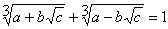

Cardano Triplets
----------------

*Source: https://projecteuler.net/problem=251*

*Difficulty rating: 70%*

A triplet of positive integers (a,b,c) is called a Cardano Triplet if it
satisfies the condition:

For example, (2,1,5) is a Cardano Triplet.

There exist 149 Cardano Triplets for which a+b+c ≤ 1000.

Find how many Cardano Triplets exist such that a+b+c ≤ 110,000,000.
