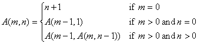

The Ackermann function
----------------------

*Source: https://projecteuler.net/problem=282*

*Difficulty rating: 70%*

For non-negative integers m, n, the Ackermann function A(m, n) is
defined as follows:

For example A(1, 0) = 2, A(2, 2) = 7 and A(3, 4) = 125.

Find A(n, n) and
give your answer mod 14^8^.
