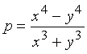

Panaitopol Primes
-----------------

*Source: https://projecteuler.net/problem=291*

Published on Friday, 7th May 2010, 09:00 pm; Solved by 859; Difficulty
rating: 45%

A prime number p is called a Panaitopol prime if
 for some positive
integers\
x and y.

Find how many Panaitopol primes are less than 5×10^15^.
