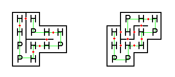

Protein folding
---------------

*Source: https://projecteuler.net/problem=300*

*Difficulty rating: 50%*

In a very simplified form, we can consider proteins as strings
consisting of hydrophobic (H) and polar (P) elements, e.g.
HHPPHHHPHHPH.\
 For this problem, the orientation of a protein is important; e.g. HPP
is considered distinct from PPH. Thus, there are 2^n^ distinct proteins
consisting of n elements.

When one encounters these strings in nature, they are always folded in
such a way that the number of H-H contact points is as large as
possible, since this is energetically advantageous.\
 As a result, the H-elements tend to accumulate in the inner part, with
the P-elements on the outside.\
 Natural proteins are folded in three dimensions of course, but we will
only consider protein folding in two dimensions.

The figure below shows two possible ways that our example protein could
be folded (H-H contact points are shown with red dots).

The folding on the left has only six H-H contact points, thus it would
never occur naturally.\
 On the other hand, the folding on the right has nine H-H contact
points, which is optimal for this string.

Assuming that H and P elements are equally likely to occur in any
position along the string, the average number of H-H contact points in
an optimal folding of a random protein string of length 8 turns out to
be 850 / 2^8^=3.3203125.

What is the average number of H-H contact points in an optimal folding
of a random protein string of length 15?\
 Give your answer using as many decimal places as necessary for an exact
result.
