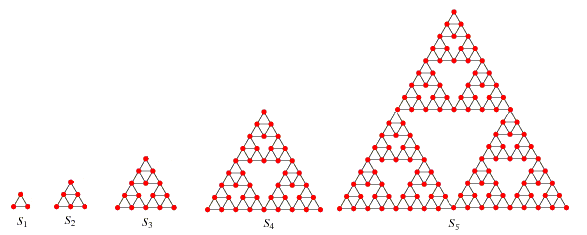

Cyclic paths on Sierpiński graphs
---------------------------------

*Source: https://projecteuler.net/problem=312*

*Difficulty rating: 50%*

- A **Sierpiński graph** of order-1 (S1) is an equilateral triangle.\
 - Sn+1 is obtained from Sn by positioning three copies of Sn so
that every pair of copies has one common corner.

Let C(n) be the number of cycles that pass exactly once through all the
vertices of Sn.\
 For example, C(3) = 8 because eight such cycles can be drawn on S3,
as shown below:

It can also be verified that :\
 C(1) = C(2) = 1\
 C(5) = 71328803586048\
 C(10 000) mod 108 = 37652224\
 C(10 000) mod 138 = 617720485\

Find C(C(C(10 000))) mod 138.
