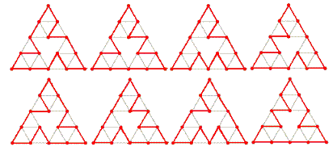

Cyclic paths on Sierpiński graphs
---------------------------------

*Source: https://projecteuler.net/problem=312*

*Difficulty rating: 50%*

- A **Sierpiński graph** of order-1 (S~1~) is an equilateral triangle.\
 - S~n+1~ is obtained from S~n~ by positioning three copies of S~n~ so
that every pair of copies has one common corner.

Let C(n) be the number of cycles that pass exactly once through all the
vertices of S~n~.\
 For example, C(3) = 8 because eight such cycles can be drawn on S~3~,
as shown below:

It can also be verified that :\
 C(1) = C(2) = 1\
 C(5) = 71328803586048\
 C(10 000) mod 10^8^ = 37652224\
 C(10 000) mod 13^8^ = 617720485\

Find C(C(C(10 000))) mod 13^8^.
