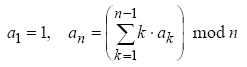

Modulo Summations
-----------------

*Source: https://projecteuler.net/problem=326*

*Difficulty rating: 55%*

Let a~n~ be a sequence recursively defined by:
.

So the first 10 elements of a~n~ are: 1,1,0,3,0,3,5,4,1,9.

Let f(N,M) represent the number of pairs (p,q) such that:

It can be seen that f(10,10)=4 with the pairs (3,3), (5,5), (7,9) and
(9,10).

You are also given that f(10^4^,10^3^)=97158.

Find f(10^12^,10^6^).
