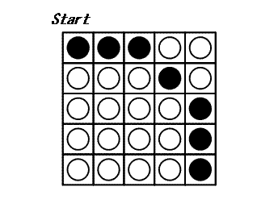

Cross flips
-----------

*Source: https://projecteuler.net/problem=331*

Published on Sunday, 3rd April 2011, 08:00 am; Solved by 241; Difficulty
rating: 100%

N×N disks are placed on a square game board. Each disk has a black side
and white side.

At each turn, you may choose a disk and flip all the disks in the same
row and the same column as this disk: thus 2×N-1 disks are flipped. The
game ends when all disks show their white side. The following example
shows a game on a 5×5 board.

It can be proven that 3 is the minimal number of turns to finish this
game.

The bottom left disk on the N×N board has coordinates (0,0);\
 the bottom right disk has coordinates (N-1,0) and the top left disk has
coordinates (0,N-1).

Let C~N~ be the following configuration of a board with N×N disks:\
 A disk at (x,y) satisfying
, shows its
black side; otherwise, it shows its white side. C~5~ is shown above.

Let T(N) be the minimal number of turns to finish a game starting from
configuration C~N~ or 0 if configuration C~N~ is unsolvable.\
 We have shown that T(5)=3. You are also given that T(10)=29 and T(1
000)=395253.

Find .
