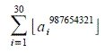
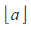

Largest roots of cubic polynomials
----------------------------------

*Source: https://projecteuler.net/problem=356*

*Difficulty rating: 60%*

Let an be the largest real root of a polynomial g(x) = x3 -
2n·x2 + n.\
 For example, a2 = 3.86619826...

Find the last eight digits
of.

*Note*: 
represents the floor function.
