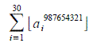

Largest roots of cubic polynomials
----------------------------------

*Source: https://projecteuler.net/problem=356*

*Difficulty rating: 60%*

Let a~n~ be the largest real root of a polynomial g(x) = x^3^ -
2^n^·x^2^ + n.\
 For example, a~2~ = 3.86619826...

Find the last eight digits
of.

*Note*: 
represents the floor function.
