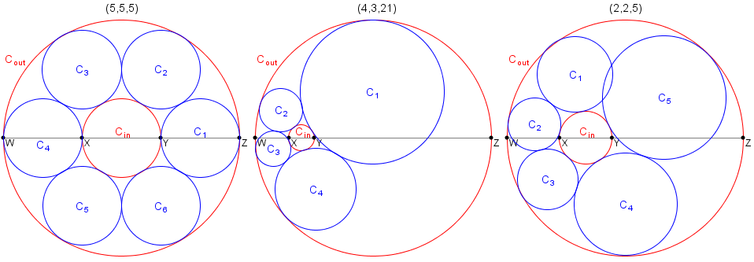

Necklace of circles
-------------------

*Source: https://projecteuler.net/problem=428*

Published on Sunday, 19th May 2013, 01:00 am; Solved by 145; Difficulty
rating: 90%

Let a, b and c be positive numbers.\
 Let W, X, Y, Z be four collinear points where |WX| = a, |XY| = b, |YZ|
= c and |WZ| = a + b + c.\
 Let Cin be the circle having the diameter XY.\
 Let Cout be the circle having the diameter WZ.\

The triplet (a, b, c) is called a *necklace triplet* if you can place k
≥ 3 distinct circles C1, C2, ..., Ck such that:

-   Ci has no common interior points with any Cj for 1 ≤ i, j ≤ k
    and i ≠ j,
-   Ci is tangent to both Cin and Cout for 1 ≤ i ≤ k,
-   Ci is tangent to Ci+1 for 1 ≤ i \< k, and
-   Ck is tangent to C1.

For example, (5, 5, 5) and (4, 3, 21) are necklace triplets, while it
can be shown that (2, 2, 5) is not.

Let T(n) be the number of necklace triplets (a, b, c) such that a, b and
c are positive integers, and b ≤ n. For example, T(1) = 9, T(20) = 732
and T(3000) = 438106.

Find T(1 000 000 000).
