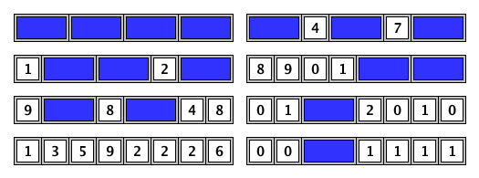

GCD and Tiling
--------------

*Source: https://projecteuler.net/problem=440*

*Difficulty rating: 60%*

We want to tile a board of length n and height 1 completely, with either
1 × 2 blocks or 1 × 1 blocks with a single decimal digit on top:

For example, here are some of the ways to tile a board of length n = 8:

Let T(n) be the number of ways to tile a board of length n as described
above.

For example, T(1) = 10 and T(2) = 101.

Let S(L) be the triple sum ∑a,b,c gcd(T(ca), T(cb)) for 1 ≤ a, b,
c ≤ L.\
 For example:\
 S(2) = 10444\
 S(3) = 1292115238446807016106539989\
 S(4) mod 987 898 789 = 670616280.

Find S(2000) mod 987 898 789.
